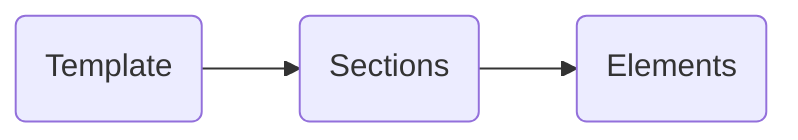

Creating your first template is simple. Inside a project, click the **Add Template** button to get started. From there, you can create a _Blank_ (or empty) Template or choose one of our _Designed_ transactional templates and modify it based on your needs.

After you name the template, you'll move to the Template Builder.

#### Template Builder

Message templates can be as simple or detailed as required for your use case. A template will have one or more sections. A section will have one or more elements.

#### Sections

Sections are layout containers for elements. They can also have styling (color, layout, padding).&#x20;

::::tip
Each Section in a template corresponds to a content area. As you roll over each section in the list to the right, the corresponding section highlights on the the left.
::::

#### Elements

Elements are broken into the following content types:

* Text
* Image
* Button
* Heading
* Divider

These atomic elements are the building blocks required to create your message. They can be individually styled. In the illustration below, you can see various elements (image, heading, text, button) within a section named "Content."&#x20;

Use the **plus (+) icon** in the Elements header to add new elements to a section.

::::tip
Similar to a Section, Elements (within a section) can have styling, and as you roll over the list of elements, the corresponding visual on the left highlights. You can click to edit the content.
::::

### Building Out Your Message

Now that you understand the basics of templates, you can start building a message to send! As mentioned earlier, you can use/modify one of the base templates we provide or design your own. Once you have a template design you like, you can easily duplicate that template or divide your template into re-usable/global sections (called "Saved Sections").&#x20;
