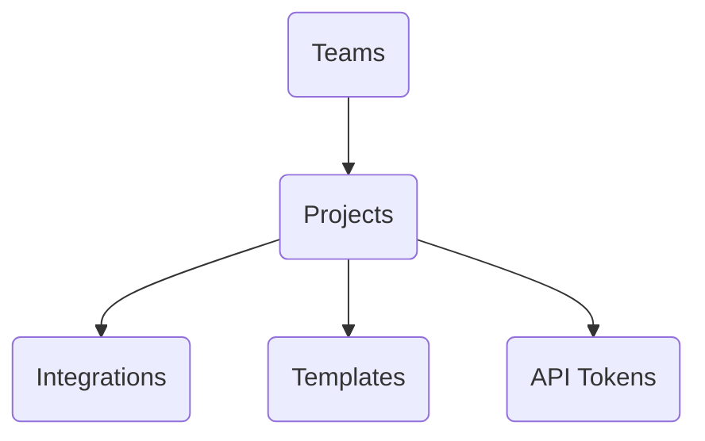
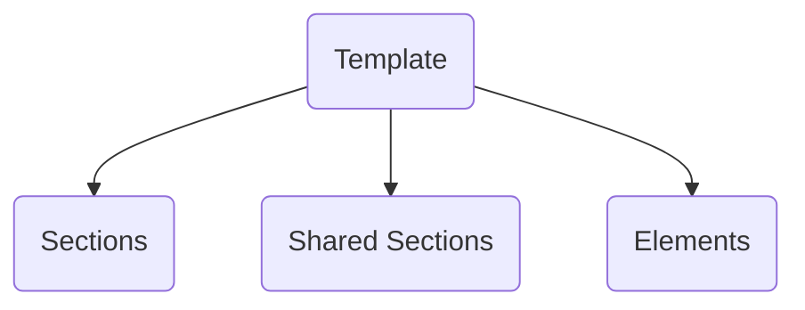

 

**Welcome!**

Enveloop helps you easily create, send, and keep track of the messages you generate from your apps. Once you sign up, it only takes a couple of minutes before you can start sending messages, either as test messages from Enveloop, from HTTP/cURL commands, or directly from your app.

Enveloop's organizational structure is simple. It consists of: Teams, Projects, and Templates. When you sign up, we have you create your first **Team** and **Project**. All that's left is for you to create your first template.

### Teams

Teams are simply a way to manage user access. You can invite one or more people to a team and they have access to all projects assigned to that team. You can create all the teams you need.

### Projects

Projects map 1-to-1 to your app. You create a project for each app that needs to talk. Each project contains message templates, dedicated API tokens for your app to use, and Integration settings for the types of messages you need to send.

### Templates

Message templates contain both the design and the content (static & dynamic) for the messages that you need to send.

You can add multiple templates, and within each template, you can preview how your message will be rendered, send test messages, and access code snippets that are auto-generated based on the dynamic content you want to use (via [Mustache](../product-guides/mustache-for-dynamic-content.md)).

Inside each template, you have common **elements** (ex: text, buttons, headers, etc.). Those elements can be grouped into **sections**. Sections provide additional styling (padding, margins, colors).

Frequently used sections can be saved as **shared sections**. This provides you the ability to build custom snippets and consistently display them across multiple message templates.

### What's Next

Now that you know the basics, you can [create and send your first template](creating-a-template.md). It only takes a couple of minutes!

